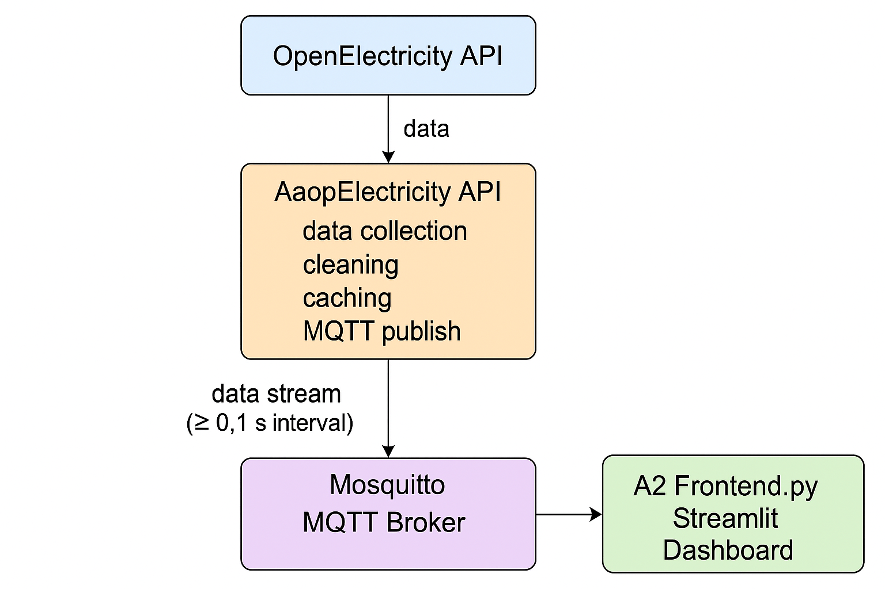
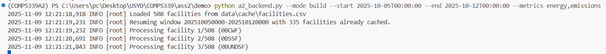
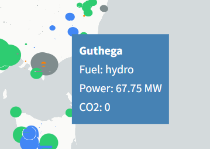
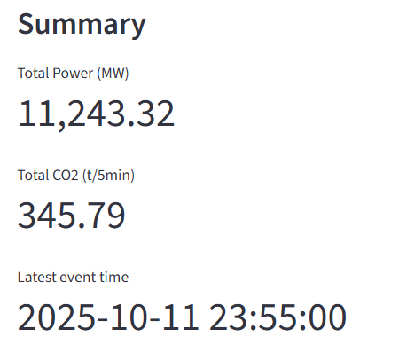

# COMP5339 Assignment 2

**Electricity Sector Data Streaming and Analysis**

**Group Members:**

* **Shilong Wu (540406973)**
* **Yunan Zhang (540597499)**


## 1. System Description

This project implements a **real-time data streaming and visualization system** for the Australian National Electricity Market (NEM).
It retrieves electricity generation and emission metrics from the **OpenElectricity API**, processes and caches them using Python, and streams new records through an **MQTT broker** to a **Streamlit dashboard** for live visualization.

### 1.1 System Architecture

The overall system consists of three tightly integrated components:

1. **Backend (`a2_backend.py`)** — Fetches and transforms OpenElectricity data, maintains CSV caches, and publishes new rows to MQTT.
2. **MQTT Broker (Mosquitto)** — Serves as the lightweight message transport layer between backend and frontend.
3. **Frontend (`a2_frontend.py`)** — A Streamlit-based dashboard that subscribes to MQTT messages, visualizes live facility-level data, and supports real-time filtering.

The continuous pipeline executes as:
**API → CSV Cache → MQTT Publisher → Streamlit Dashboard Subscriber.**

<p align="center">
  
  <br>
  <b>Figure 1.</b> System architecture showing the continuous data flow from OpenElectricity API to Streamlit dashboard.
</p>

This architecture ensures that every new data point retrieved from the API is cleaned, cached, streamed, and visualized with minimal delay, achieving near-real-time monitoring.


## 2. Data Acquisition, Cleaning, and Transformation

### 2.1 Data Retrieval

The backend fetches both **facility metadata** and **time-series metrics** using the OpenElectricity API:

* `/facilities/` — Provides metadata such as name, coordinates, fuel type, and region.
* `/data/facilities/{network}` — Provides 5-minute interval metrics for `energy` (MWh) and `emissions` (t).

Configuration is managed by the `Settings` dataclass, including network name, time range, metrics, and broker parameters.
Example command:

```bash
python a2_backend.py --mode build \
--start 2025-10-05T00:00:00 --end 2025-10-12T00:00:00 \
--metrics energy,emissions
```
As shown in **Figure 2**, it successfully detects **508 facilities** and resumes the requested time window (2025-10-05 → 2025-10-12).
The manifest file automatically skips **335 facilities** already cached, so only the remaining records are downloaded.
Each uncached facility is then processed sequentially for both `energy` and `emissions `metrics, which are stored in `data/cache/nem_metrics.csv`.

<p align="center">  <br> <b>Figure 2.</b> Backend running in <code>build</code> mode. The log shows 508 facilities loaded from cache, 335 already cached within the selected window, and new facilities being processed sequentially. </p>
This output verifies that the incremental-build logic works as intended—avoiding redundant API calls and maintaining up-to-date cached data for subsequent streaming.


### 2.2 Data Cleaning and Metadata Integration

The `discover_facilities()` function processes facility metadata and applies strict validation rules:

* Removes entries missing coordinates or network identifiers.
* Extracts the **primary fuel type** from the first valid `fueltech_id`.
* Standardizes columns to: `facility_id`, `name`, `fuel`, `state`, `lat`, `lon`.
* Writes cleaned results to `data/cache/facilities.csv`.

If the file already exists, it is reused, enabling incremental builds across sessions.


### 2.3 Data Transformation

The transformation logic, defined in `_pivot_and_enrich()`, performs several steps:

1. **Pivot to Wide Format** — Combines long-form metric rows into columns `energy_mwh` and `emissions_t`.
2. **Derive Power (MW)** —
   [
   \text{power_mw} = \frac{\text{energy_mwh}}{0.0833}
   ]
   since each time step equals 5 minutes (0.0833 hours).
3. **Join Metadata** — Merges metrics with facility attributes.
4. **Add Timestamps** — Adds both `ts_event` (event time) and `ts_ingest` (ingestion time).

The final dataset is appended to `data/cache/nem_metrics.csv`.

<p align="center">

| facility_id | ts_event            | ts_ingest                  | power_mw | energy_mwh | emissions_t | name          | fuel       | state | lat       | lon       |
| ----------- | ------------------- | -------------------------- | -------- | ---------- | ----------- | ------------- | ---------- | ----- | --------- | --------- |
| YSWF        | 2025-10-11T21:20:00 | 2025-11-08T02:23:34.788838 | 22.35    | 1.8625     | 0           | Yaloak South  | wind       | VI    | -37.71647 | 144.24195 |
| MTGELWF     | 2025-10-05T00:15:00 | 2025-11-08T02:19:06.110573 | 29.514   | 2.4595     | 0           | Mt Gellibrand | wind       | VI    | -38.25766 | 143.79865 |
| LOYYB       | 2025-10-07T20:30:00 | 2025-11-08T02:17:52.478264 | 577.13   | 48.0938    | 53.9757     | Loy Yang B    | coal_brown | VI    | -38.25362 | 146.58559 |

<br>
<b>Table 1.</b> Cleaned and enriched data sample from the NEM dataset.
</p>


## 3. Data Integration and Continuous Publishing

### 3.1 Cache Management and Manifest System

To avoid redundant API calls, `build_cache()` maintains a **manifest file (`manifest.csv`)** that logs:

* Date window of the current build
* Cache size and timestamp
* Processed `facility_id` entries

When the script is re-executed, previously cached facilities are skipped using `_load_checkpoint()`, ensuring efficient incremental updates.


### 3.2 MQTT Publishing Logic

The backend uses `paho-mqtt` to stream data rows to the topic `nem/events`.
Each cache row is converted to JSON and published with a **minimum 0.1 s delay (`PUBLISH_DELAY`)** to preserve temporal order.

Example MQTT payload:

```json
{
  "facility_id": "LOYYB",
  "facility_name": "Loy Yang B",
  "fuel": "coal_brown",
  "state": "VI",
  "lat": -38.25,
  "lon": 146.58,
  "ts_event": "2025-10-07T20:30:00",
  "power_mw": 577.13,
  "energy_mwh": 48.09,
  "emissions_t": 53.97
}
```


### 3.3 Continuous Loop Execution

The function `loop_pipeline()` orchestrates all backend steps:

```
build_cache() → stream_cache() → sleep(60s)
```

This creates an automated real-time workflow that periodically fetches, transforms, and streams new data every 60 seconds.
Extensive logging ensures reliability during long runs.


## 4. Data Visualization (Frontend)

### 4.1 Dashboard Overview

The Streamlit frontend (`a2_frontend.py`) provides an **interactive real-time dashboard**.
It loads the cached CSV on startup, subscribes to the MQTT topic `nem/events`, and continuously updates the map and summary panels.

<p align="center">
  
  <br>
  <b>Figure 3.</b>  dashboard overview.
</p>

### 4.2 MQTT Subscriber Implementation

The `MQTTSubscriber` class runs in a background thread to maintain live data flow:

* Connects to `localhost:1883`
* Subscribes to `nem/events`
* Parses and validates incoming JSON messages
* Merges new records into the active DataFrame via `apply_event()`

Invalid messages are logged but skipped, ensuring consistent performance.


### 4.3 Visualization and Interactivity

* **Color coding by fuel type:**
  Coal = dark gray, Gas = salmon, Hydro = blue, Solar = gold, Wind = green.
* **Marker scaling:** Radius ∝ √(power_mw), bounded within [800 m, 120 km].
* **Sidebar controls:** Adjust broker settings, filter by fuel or region, reload cache, toggle auto-refresh (default = 5 s).
* **Summary panel:** Displays total active power (MW), total CO₂ emissions (t/5min), and the timestamp of the latest event.

<p align="center">
  
  

  <br>
<p align="center">
  <b>Figure 4.</b> facilities detail(left) and dynamic summary metrics(right).
</p>


## 5. Findings, Challenges, and Future Improvements

### 5.1 Key Findings

* **Coal and gas plants** (e.g., LOYYB) dominate total energy output and emissions.
* **Wind and solar facilities** (e.g., YSWF, MTGELWF) produce clean energy but with higher variability.
* The system consistently achieved **1–2 s end-to-end latency**, validating the real-time streaming design.


### 5.2 Challenges and Solutions

| Challenge             | Description                                        | Solution                                        |
| --------------------- | -------------------------------------------------- | ----------------------------------------------- |
| API Rate Limit        | OpenElectricity free-tier limited to 500 calls/day | Introduced caching and manifest checkpointing   |
| Multi-unit Facilities | Several plants have multiple sub-units             | Aggregated metrics within `_pivot_and_enrich()` |
| MQTT Stability        | Occasional broker disconnections                   | Implemented auto-reconnect and buffered queue   |
| Map Scaling           | High MW values distorted marker sizes              | Applied square-root scaling with bounds         |

### 5.3 Future Improvements

* Incorporate **market price** and **demand** data to extend analysis scope.
* Add **historical charts** and **trend visualizations** for long-term insights.
* Deploy on a **cloud-based MQTT broker** for multi-user access.
* Integrate **InfluxDB and Grafana** for scalable, persistent time-series analytics.


## 6. Individual Contributions

* **Shilong Wu (540406973):** 
Developed the Streamlit frontend (`a2_frontend.py`), implemented MQTT subscription, Pydeck-based visualization, filtering system, and overall dashboard layout. Conducted integration testing.
* **Yunan Zhang (540597499):** 
Developed the backend module (`a2_backend.py`), including data retrieval, caching, transformation, and MQTT streaming. Implemented manifest tracking and continuous loop logic.


## 7. Repository Access

All source code for this project, including the backend (`a2_backend.py`), frontend (`a2_frontend.py`), and configuration files, is publicly available at:

🔗 **GitHub Repository:** [https://github.com/Richu-725/demo](https://github.com/Richu-725/demo)

The repository contains:
- Complete Python source files (`a2_backend.py`, `a2_frontend.py`)
- Configuration and requirements files (`requirements.txt`, `API_key.txt`)
- Cached data samples under `/data/cache/`
- Instructions for running the backend (`build`, `stream`, and `loop` modes)
- Streamlit dashboard implementation and screenshots

This ensures full reproducibility of the system and allows independent verification of functionality.

